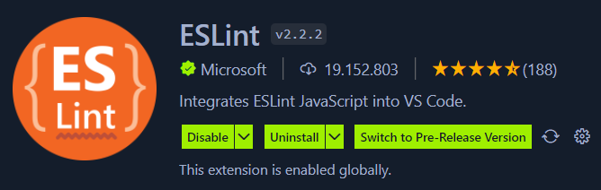
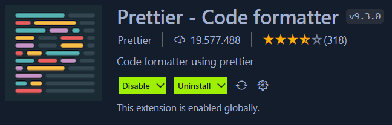
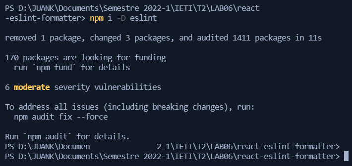

# Desarrollo del Laboratorio

## Parte 1: VSCode

Instalamos las extensiones requeridas

## Parte 2: Eslint

Editamos la configuracion "eslintConfig" y luego ejecutamos el comando `npm i -D eslint`

Añadimos los 2 nuevos scripts