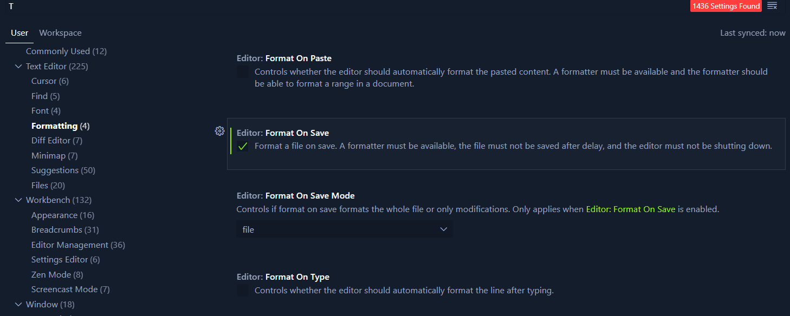
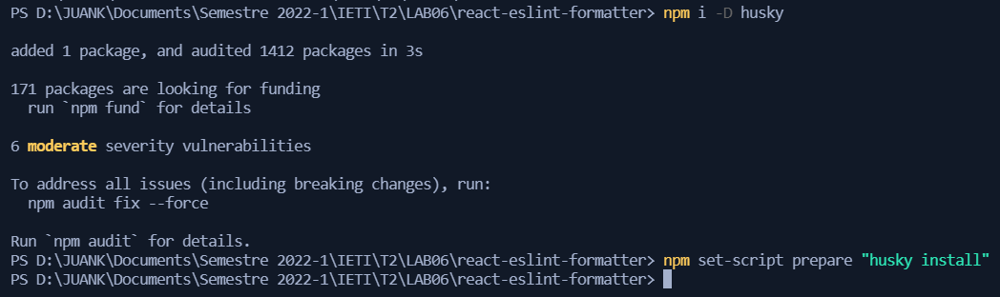
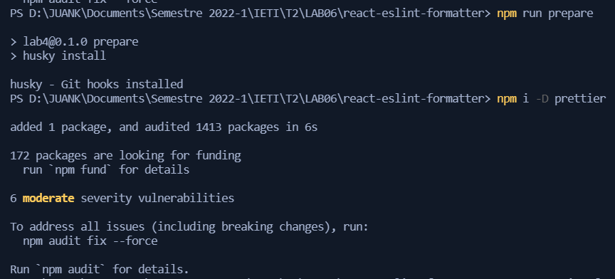
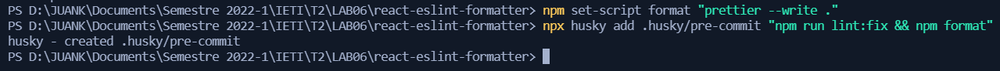

# Desarrollo del Laboratorio

## Parte 1: VSCode

Instalamos las extensiones requeridas

## Parte 2: Eslint

Editamos la configuracion "eslintConfig" y luego ejecutamos el comando `npm i -D eslint`

Añadimos los 2 nuevos scripts

## Parte 3: Prettier

Activamos la opción de "Format On Save"

## Parte 4: Husky

Realizamos la configuracion de Husky para que al momento de hacer commit se validen posibles errores de eslint y el codigo se formatee correctamente

